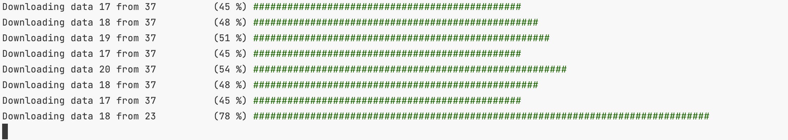

# M3U8 Downloader

The application is designed to download video files in m3u8 format.

## Install

You can get this from nuget https://www.nuget.org/packages/m3u8-downloader/

```shell
dotnet tool install --global m3u8-downloader --version 1.0.3
```

## Using

```shell
m3u8downloader url=https://videosite.com/video out=myvideo
```



If OK, will create new file myvideo.ts.

